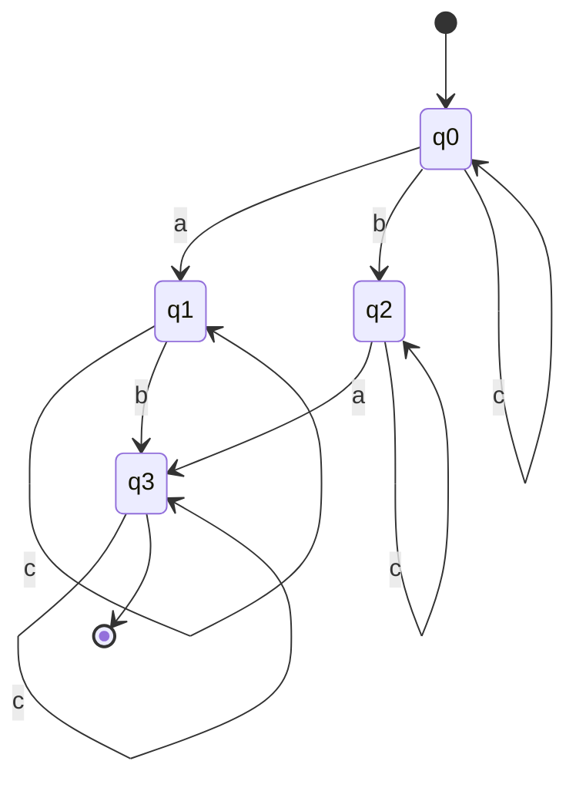

<!-- Paul Bittner Compilerbau SoSe 2024
Sebastian Krieter Blatt 01 5 Punkte
Raum: F 1 110 Besprechung in der Übung am 02.05.2024, 13:15–15:45
Lernziele
■ Reguläre Ausdrücke
■ Konstruktion NEA, DEA
■ Praxis: Lexer
Aufgabe 1 Reguläre Ausdrücke 1 Punkt
Geben Sie reguläre Ausdrücke an, die die folgenden Sprachen beschreiben.
Hinweis: Dabei sollen nur die Operatoren aus der Vorlesung genutzt werden. Siehe Foliensatz 2.1 Slide 22/23.
a) Die Menge aller Wörter w ∈ {a, b}∗, in denen jedem a direkt mindestens zwei b’s vorangehen.
b) Die Menge der DecimalIntegerLiterals in Java, bestehend aus der 0 und Worten, die aus ein oder mehr
Ziffern ohne führende Null bestehen, optional abgeschlossen durch ein Suffix L oder l, falls das Literal vom
Typ long ist.
Aufgabe 2 Konstruktion NEA 1 Punkt
Sei L ⊂ {a, b, c}∗ die Sprache aller Wörter aus Zeichen a, b, c, in der jedes Wort mindestens ein a und ein b
enthält. Konstruieren Sie für L einen nichtdeterministischen endlichen Automaten (NEA). Hinweis: Jeder DEA
ist auch ein NEA.
Aufgabe 3 Äquivalenzumformung DEA 1 Punkt
Aus jedem regulären Ausdruck r kann schrittweise ein minimaler deterministischer Automat konstruiert werden,
der die von r beschriebene reguläre Sprache L(r) erkennt. Führen Sie diese Konstruktion für den regulären
Ausdruck r = b(a|b)∗bc durch.
a) Regulärer Ausdruck ⇒ NEA: Konstruieren Sie einen nichtdeterministischen endlichen Automaten M1, der die
von r beschriebene Sprache akzeptiert. Nutzen Sie hierbei die Thompson Konstruktion (wie in der Vorlesung
vorgestellt).
b) NEA ⇒ DEA: Konstruieren Sie aus M1 einen deterministischen Automaten M2, der dieselbe Sprache wie
M1 akzeptiert.
c) DEA ⇒ minimaler DEA: Konstruieren Sie aus M2 einen DEA M3, der dieselbe Sprache wie M2 akzeptiert
und eine minimale Zustandsmenge besitzt.
Aufgabe 4 Praxis: Lexer 01 2 Punkte
Im Rahmen des ersten und zweiten Übungsblattes sollt ihr einen Recursive-Descent-Parser entwickeln, um aritme-
thische Terme zu parsen und zu evaluieren. Die Programmiersprache, die ihr dazu verwendet, ist euch überlassen.
Gern könnt ihr die Aufgabe nutzen, um eine neue Programmiersprache zu lernen oder zu vertiefen, oder aber
1 of 2
eine Sprache nutzen mit der ihr vertraut seid, oder die dem Pseudocode aus der Vorlesung ähnelt. Es dürfen
keine externen Bibliotheken mit Lexing- oder Parsing-Funktionalitäten genutzt werden.
Die Sprache, die ihr lexen, parsen und interpretieren sollt, sind arithmetische Terme. Die Sprache soll folgende
Symbole unterstützen: natürliche Zahlen, + (Addition), - (Subtraktion), * (Multiplikation), / (Division), (
(Klammer auf), ) (Klammer zu), ˆ (Potenz). Als Eingabe erhält euer Parser eine Zeichenkette. Wenn diese
Zeichenkette ein korrekter arithmetischer Term aus diesen Symbolen ist, soll euer Parser das Ergebnis berechnen
und ausgeben. Zum Beispiel soll bei Eingabe der Zeichenkette
(2 + 3) * 4ˆ(2)
das Ergebnis 80 ausgegeben werden. Dabei sollen Leerzeichen beliebig zulässig sein und keinen Einfluss auf die
Semantik haben (z.B. soll 2 + 3 äquivalent zu 2+3 sein und keine Fehler hervorrufen). Der Einfachheit halber
darf angenommen werden, dass der Exponent einer Potenz immer in Klammern steht (z.B. 2ˆ(3)), und dass
das unäre Minus nicht Teil der Sprache ist (eine Negation kann dann als 0 - 3 dargestellt werden statt als -3).
Die folgenden Präzedenzen (Operratorrangfolge) sollen eingehalten werden:
ˆ bindet stärker als * und /
* und / binden stärker als + und -
* bindet genauso stark wie /
+ bindet genauso stark wie -
Im Rahmen dieses Aufgabenblattes sollt ihr zunächst einen Lexer entwickelt. Mit dem nächsten Aufgaben-
blatt, entwickelt ihr dann später den Parser und Interpreter. Um den Lexer zu entwickelt, geht wie folgt vor:
a) Identifiziert die nötigen Tokenklassen entsprechend den Angaben oben. Überlegt euch dabei für jede Klasse
einen geeigneten Namen und den regulären Ausdruck, der die Tokens dieser Klasse beschreibt.
b) Entwickelt einen DEA, der eure Tokenklassen akzeptiert. Wenn der Automat einen Endzustand erreicht,
bedeutet das, dass ihr ein Token eingelesen habt (oder einen validen Präfix davon).
c) Implementiert euren Lexer mit einem Scanner-Algorithmus und eurem DEA. Orientiert euch dabei an der
Scanner-Implementierung aus der Vorlesung. Für die Implementierung der Transitionen eures DEAs (also der
∆-Funktion) empfehlen wir euch eine Successor-Tabelle (z.B. als Array oder Map) zu verwenden oder die
Funktion direkt als Funktion in eurer Programmiersprache zu implementieren. Euer Scanner-Algorithmus soll
außerdem alle Whitespace-Tokens aus dem Tokenstream entfernen.
d) Prüft ob euer Lexer für den Beispielausdruck oben den korrekten Tokenstream erzeugt. Euer Stream /
eure Liste an Tokens sollte in etwa so aussehen (wobei Anführungszeichen “” hier Anfang und Ende einer
Zeichenkette markieren wie üblich für Zeichenketten (Strings) in vielen Programmiersprachen):
“(”, “2”, “+”, “3”, “)”, “*”, “4”, “ˆ”, “(”, “2”, “)”
Euer Lexer sollte u.a. auch folgende Zeichenketten akzeptieren:
1, 1 - 23ˆ(456), 3141592 / (1 * 2) + 42.
Euer Lexer sollte Zeichenketten, die keine arithmetischen Ausdrücke, der hier beschriebenen Sprache, sind,
ablehnen und einen Fehler melden, wie z.B. für die Zeichenketten:
1.2, + 4, 1 + (2 - 3, I bims 1 String.
2 of 2 -->

Aufgabe 1:

a): `(bba|b)*`

Proof:

```python
regex = r'(bba|b)*'

def gen_random_ab_string():
    import random
    return ''.join(random.choices('ab', k=random.randint(0, 10)))

def check_ab_string(s):
    # for each a: check if index -1, -2 is b
    for i, c in enumerate(s):
        if c == 'a':
            if i < 2:
                return False
            if s[i-1] != 'b' or s[i-2] != 'b':
                return False
    return True

def check_with_regex(regex):
    import re
    for _ in range(1000):
        s = gen_random_ab_string()
        if check_ab_string(s) != bool(re.fullmatch(regex, s)):
            print(s)
```

prints nothing, so the regex is correct.

b): `0|([1-9][0-9]*)([lL])?`

Will not be proven.

Aufgabe 2:

Task: Construct a NEA for the language L = {a, b, c}∗ where each word contains at least one a and one b.

Useful states:

- q0: start state
- q1: a seen
- q2: b seen
- q3: a and b seen # final state


```kroki-graphviz
digraph finite_state_machine {
    rankdir=LR;
    size="8,5"
    node [shape = doublecircle]; q3;
    node [shape = circle];
    q0 -> q1 [label = "a"];
    q0 -> q2 [label = "b"];
    q0 -> q0 [label = "c"];
    q1 -> q1 [label = "a"];
    q1 -> q3 [label = "b"];
    q1 -> q1 [label = "c"];
    q2 -> q3 [label = "a"];
    q2 -> q2 [label = "b"];
    q2 -> q2 [label = "c"];
    q3 -> q3 [label = "a"];
    q3 -> q3 [label = "b"];
    q3 -> q3 [label = "c"];
    node [shape = point ]; start
    start -> q0
}
```

Aufgabe 3:

a): Construct a NEA for the regular expression r = b(a|b)∗bc using the Thompson construction.

```kroki-graphviz
digraph finite_state_machine {
    rankdir=LR;
    size="8,5"
    node [shape = point ]; start
    node [shape = circle];
    
    start -> q0
    // symbol b:
    q0 -> q1 [label = "b"];
    // kleene star:
    q1 -> q2 [label = "ε"]; // inside kleene star
    q1 -> q3 [label = "ε"]; // finish of kleene star
    q2 -> q4 [label = "a"];
    q2 -> q4 [label = "b"];
    q4 -> q2 [label = "ε"];
    q4 -> q3 [label = "ε"];
    // symbol b:
    q3 -> q5 [label = "b"];
    // symbol c:
    node [shape = doublecircle];
    q5 -> q6 [label = "c"];
}
```

b): Construct a DEA from the NEA.

```kroki-graphviz
digraph finite_state_machine {
    rankdir=LR;
    size="8,5"
    node [shape = point ]; start
    node [shape = circle];
    
    start -> q0
    q0 -> q1q2q3 [label = "b"];
    q1q2q3 -> q2q3q4 [label = "a"];
    q1q2q3 -> q2q3q4q5 [label = "b"];
    q2q3q4 -> q2q3q4 [label = "a"];
    q2q3q4 -> q2q3q4q5 [label = "b"];
    q2q3q4q5 -> q2q3q4 [label = "a"];
    q2q3q4q5 -> q2q3q4q5 [label = "b"];
    node [shape = doublecircle];
    q2q3q4q5 -> q6 [label = "c"];
}
``` 

c): Construct a minimal DEA from the DEA.
    
Already minimal.

Aufgabe 4:

Implement an arithmetic term lexer/parser.

a) Token classes:

```python
import re

integer = re.compile(r'0|([1-9][0-9]*)')
operator = re.compile(r'\+|-|\*|/|\^')
lparen = re.compile(r'\(')
rparen = re.compile(r'\)')
```

b) DEA:

For each token class, create a state. If a valid token prefix, then accept state.

```kroki-graphviz
digraph finite_state_machine {
    rankdir=LR;
    size="8,5"
    node [shape = point ]; start
    node [shape = circle];
    start -> q0;
    node [shape = doublecircle];
    q0 -> q1 [label = "0"];
    q0 -> q2 [label = "1-9"];
    q2 -> q2 [label = "0-9"];
    q0 -> q3 [label = "+"];
    q0 -> q3 [label = "-"];
    q0 -> q3 [label = "*"];
    q0 -> q3 [label = "/"];
    q0 -> q4 [label = "\("];
    q0 -> q5 [label = "\)"];
    node [shape = doublecircle];
}
```

c) Implement lexer:

```python
# takes a generator of chars, returns generator of tokens
class Token:
    whatami: str
    # oneof integer, operator, lparen, rparen
    value: str
    def __init__(self, whatami, value):
        assert whatami in ['integer', 'operator', 'lparen', 'rparen']
        self.whatami = whatami
        self.value = value

# automaton table: given state, input, new state
table = {
    0: {'0': 1, '1': 2, '+': 3, '-': 3, '*': 3, '/': 3, '(': 4, ')': 5},
    1: {},
    # 2: {'0-9': 2},
    2: {'0': 2, '1': 2, '2': 2, '3': 2, '4': 2, '5': 2, '6': 2, '7': 2, '8': 2, '9': 2},
    3: {},
    4: {},
    5: {}
}

accepting = {1, 2, 3, 4, 5}

def lexer(chars):
    state = 0
    buffer = ''
    # call chars = next(chars) to get next char
    while True:
        try:
            c = next(chars)
        except StopIteration:
            break
        # if whitespace, ignore
        if c.isspace():
            continue
        if c in table[state]:
            # accepting transition, don't yield yet
            assert state in accepting
            buffer += c
            state = table[state][c]
        else:
            # not accepting transition, yield buffer
            if buffer:
                # check state for type
                if state == 1 or state == 2:
                    yield Token('integer', buffer)
                elif state == 3:
                    yield Token('operator', buffer)
                elif state == 4:
                    yield Token('lparen', buffer)
                elif state == 5:
                    yield Token('rparen', buffer)
                # reset buffer
                buffer = ''
                # reset state to read c again
                try:
                    state = table[0][c]
                except KeyError:
                    raise ValueError(f'Invalid character {c}')
    # yield last buffer
    if buffer:
        # check state for type
        if state == 1 or state == 2:
            yield Token('integer', buffer)
        elif state == 3:
            yield Token('operator', buffer)
        elif state == 4:
            yield Token('lparen', buffer)
        elif state == 5:
            yield Token('rparen', buffer)

# additionally, we want stricter checking for the lexer
# mainly: parentheses should be balanced
# and: operators should be surrounded by expressions
# and: the whole token stream should be a valid expression

def check_parentheses_and_expression(tokens):
    stack = []
    is_start_expr = True
    
    while True:
        try:
            token = next(tokens)
        except StopIteration:
            break
        if token.whatami == 'lparen':
            stack.append(token)
            is_start_expr = True
        elif token.whatami == 'rparen':
            if not stack:
                raise ValueError('Unbalanced parentheses')
            stack.pop()
            is_start_expr = False
        elif token.whatami == 'operator':
            if is_start_expr:
                raise ValueError('Operator at start of expression')
            is_start_expr = True
        elif token.whatami == 'integer':
            is_start_expr = False
        else:
            raise ValueError('Invalid token')
        yield token
    if stack:
        raise ValueError('Unbalanced parentheses')
    if is_start_expr:
        raise ValueError('Operator at end of expression')
```
