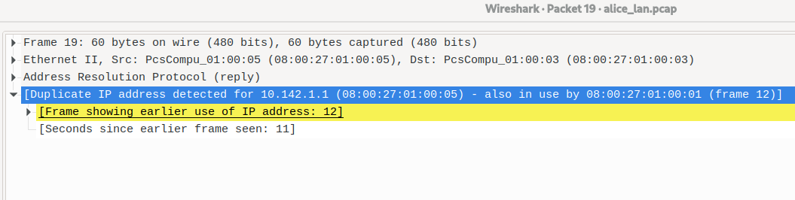

Welche Netzwerkadressen?

---

• Alice will ein IP Paket an Bob schicken
• Folgende Adressen müssen im Paket enthalten sein:
• Src IP: Alice
• Src MAC: Alice
• Dst IP: Bob
• Dst MAC: ???
B. Bob

---

Alice will ein IP Paket an DNS schicken
• Folgende Adressen müssen im Paket enthalten sein:
• Src IP: Alice
• Src MAC: Alice
• Dst IP: DNS
• Dst MAC: ???
C. Router

---

Alice - Frage 1
• Schaut euch im Folgenden alice_lan.pcap an
• Welchen Angriff führt Eve aus?
B. ARP Cache Poisoning
• Wie ist der Angriff erkennbar?

---

Alice - Frage 2
• Welches Paket (Paketnummer in Wireshark) ist das erste “Angriffspaket”?
D. 19
• Welchen Traffic kann Eve durch diesen Angriff sehen/verändern?
Traffic zu 10.142.1.1

---

Alice - Frage 3
• Hat Eve auch den Router angegriffen? Wie ist dies erkennbar?
Eve hat halt den Traffic von allen für den Router abgefangen

Eve kann auch den Router davon überzeugen ein bestimmter Client zu sein, um so den Traffic von diesem Client abzufangen. In diesem Fall ist der Router das Opfer.

• Wie kann sich Alice verteidigen?
Consult your operating system’s documentation for instructions on how to configure ARP.

---

Bob - Frage 1
• Schaut euch im Folgenden bob_lan.pcap an
• Welchen Angriff führt Eve aus?
C. DHCP Spoofing
• Wie ist der Angriff erkennbar?

---

Bob - Frage 2
• Welches Paket (Paketnummer in Wireshark) ist das erste “Angriffspaket”?
A. 4
• Was ist die Folge des Angriffs? Welchen Traffic kann Eve sehen/verändern?
Traffic von Netzwerkgeräten zum Internet, Traffic von Internet zu Netzwerkgeräten

---

Bob - Frage 3
• Kann Eve auch den Router angreifen?

Wenn der Router ein dynamischer DHCP Client ist, kann Eve den Router angreifen, indem sie sich als DHCP Server ausgibt.

• ( Tipp: Was sind die Voraussetzungen für den Angriff? )

Der Router muss ein dynamischer DHCP Client sein.

• Kann Bob sich selbst verteidigen?

Bob kann sich selbst verteidigen, indem er die IP Adresse des DHCP Servers manuell einträgt. Alternativ sollte er die Betriebssystemdokumentation konsultieren.